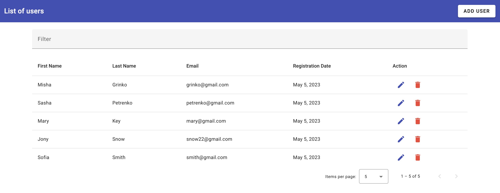

# Users app

A simple web application for managing a list of users.

## Technologies

- Angular
- NestJS
- Angular Material

## Screenshot

## 

## Running the project

To run the project, execute the following commands:
⚠️ The Angular CLI requires a minimum Node.js version of either v14.20, v16.13 or v18.10.

1. Clone the repository to your local machine, open terminal and clone repo with command bellow.

```
$ git clone https://github.com/NadiiaKoch/users-app-test.git
```

2. Open project in terminal.
   Set up project and install necessary packages:

```
$ cd users-app/usersapp-backend
```

3. Set up project and install necessary packages:

```
$ npm install
```

4. Add command to terminal:

```
$ npm start
```

5. Open a new terminal.

```
$ cd users-app/usersapp-frontend
```

6. Set up project and install necessary packages:

```
$ npm install
```

7. Add command to terminal:

```
$ npm start
```

8. Open application in your browser http://localhost:4200/
